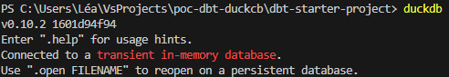
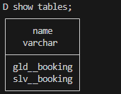

Dans ce POC, je te montre comment faire fonctionner dbt avec DuckDB en local (Windows).

### Environnement
* Windows 11
* VSCode: 1.88.1
* dbt: 1.7.13
* duckdb: 1.7.4

### Setup dbt
* Création du venv: *py -m venv dbt_env_poc*
* Accès au venv: *.\dbt_env_poc\Scripts\Activate.ps1*
* installation des packages: *python -m pip install dbt-core* puis *python -m pip install dbt-duckdb*

### Setup DuckDB
* Installation de la CLI DuckDB (commande Windows, pour les autres environnements voir la documentation [ici](https://duckdb.org/docs/installation/?version=stable&environment=cli&platform=win&download_method=package_manager)): *winget install DuckDB.cli*

### Exécution et vérification des transformations
* Exécuter les transformations: *dbt run*
* Exécuter DuckDB dans le dossier du projet: \

* Ouvrir la base de données dev.duckdb initialisée dans profile.yml: *.open dev.duckdb*
* Vérifier la création des tables dans votre base de données: \

### Ressources:
- [Tuto by MotherDuck](https://motherduck.com/blog/duckdb-dbt-e2e-data-engineering-project-part-2/)
- [Documentation DuckDB](https://duckdb.org/docs/)
- [Dataset de test](https://www.kaggle.com/datasets/anandshaw2001/airlines-booking-csv)